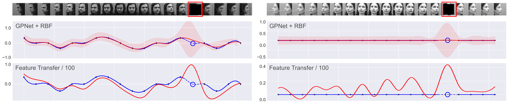

<p align="center">

</p>


This repository contains the official pytorch implementation of the paper: 

*"Deep Kernel Transfer in Gaussian Processes for Few-shot Learning" (2019) Patacchiola, Turner, Crowley, and Storkey* [[download paper]]()

Please cite this paper if you use the method or code in this repository as part of a published research project:

```
@article{patacchiola2019deep,
  title={Deep Kernel Transfer in Gaussian Processes for Few-shot Learning},
  author={Patacchiola, Massimiliano and Turner, Jack and Crowley, Elliot and Storkey, Amos},
  journal={arXiv preprint arXiv:},
  year={2019}
}
```

Requirements
-------------

1. Python >= 3.0
2. Numpy >= 1.17
3. [pyTorch](https://pytorch.org/) >= 1.2.0
4. [gpyTorch](https://gpytorch.ai/) >= 0.3.5
5. (optional) [TensorboardX](https://pypi.org/project/tensorboardX/) 


Experiments
============

These are the instructions to train and test the methods reported in the paper in the various conditions.

**Download and prepare a dataset.** This is an example of how to download and prepare a dataset for training/testing. Here we assume the current directory is the project root folder:

```
cd filelists/DATASET_NAME/
sh download_DATASET_NAME.sh
```

Replace `DATASET_NAME` with one of the following: `omniglot`, `CUB`, `miniImagenet`, `emnist`, `QMUL`. Notice that miniImagenet is a large dataset that requires substantial storage, therefore you can save the dataset in another folder and then change the entry in `configs.py` in accordance.

**Methods.** There are a few available methods that you can use: `gpnet`, `maml`, `maml_approx`, `protonet`, `relationnet`, `matchingnet`, `baseline`, `baseline++`. You must use those exact strings at training and test time when you call the script (see below). Note that our method is `gpnet`, and that `baseline` corresponds to feature transfer in our paper. By default GPNet has a linear kernel, to change this please edit the entry in `configs.py`.

**Backbone.** The script allows training and testing on different backbone networks. By default the script will use the same backbone used in our experiments (CNN-4). Check the file `backbone.py` for the available architectures, and use the parameter `--model=BACKBONE_STRING` where `BACKBONE_STRING` is one of the following: `Conv4`, `Conv6`, `ResNet10|18|34|50|101`.

Regression
-----------


Classification
---------------

**Train classification.** The various methods can be trained using the following syntax:

```
python train.py --dataset="miniImagenet" --method="gpnet" --train_n_way=5 --test_n_way=5 --n_shot=1 --seed=1 --train_aug
```

This will train GPNet 5-way 1-shot on the mini-ImageNet dataset with seed 1. The `dataset` string can be one of the following: `CUB`, `miniImagenet`. At training time the best model is evaluated on the validation set and stored as `best_model.tar` in the folder `./save/checkpoints/DATASET_NAME`. The parameter `--train_aug` enables data augmentation. The parameter `seed` set the seed for pytorch, numpy, and random. Set `--seed=0` or remove the parameter for a random seed. Additional parameters are reported in the file `io_utils.py`.

**Test classification.** For testing `gpnet`, `maml` and `maml_approx` it is enough to repeat the train command replacing the call to `train.py` with the call to `test.py` as follows:

```
python test.py --dataset="miniImagenet" --method="gpnet" --train_n_way=5 --test_n_way=5 --n_shot=1 --seed=1 --train_aug
```

Other methods require to store the features (for efficiency) before testing, this can be done running the script `save_features.py` before calling `test.py`. For instance, if you trained a `protonet`, you should call:

```
python save_features.py --dataset="miniImagenet" --method="protonet" --train_n_way=5 --test_n_way=5 --n_shot=1 --seed=1 --train_aug
python test.py --dataset="miniImagenet" --method="protonet" --train_n_way=5 --test_n_way=5 --n_shot=1 --seed=1 --repeat=5 --train_aug
```

We noticed that the [original code](https://github.com/wyharveychen/CloserLookFewShot) has a large variance on test tasks. To reduce this variance we add the parameter `repeat=N`. It iterates N times with different seeds and take an average over the N tests, we used `N=5` (3000 tasks) in our experiments.


Cross-domain classification
---------------------------

For the cross-domain classification experiments the procedure is the same described previously. The only difference is that the available datasets are: `cross_char`, and `cross`. The former being `omniglot -> EMNIST`, and the latter `miniImagenet -> CUB`. Here an example of training procedure:

```
python train.py --dataset="cross_char" --method="gpnet" --train_n_way=5 --test_n_way=5 --n_shot=1 --seed=1
```

Note that the parameter `--train_aug` (data augmentation) is not used for `cross_char` but only for `cross`.

Acknowledgements
---------------

This repository is a fork of: [https://github.com/wyharveychen/CloserLookFewShot](https://github.com/wyharveychen/CloserLookFewShot)
